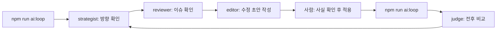

# Workflow: Portfolio Content Loop

## 목적

포트폴리오 콘텐츠를 작게 고치고 다시 점검합니다.

## agent 순서

1. `portfolio-content-strategist`
   - 어떤 역량을 더 잘 보여 줄지 정합니다.
2. `portfolio-reviewer`
   - 비어 있거나 약한 필드를 찾습니다.
3. `portfolio-content-editor`
   - JSON에 넣을 문장 초안을 작성합니다.
4. 사람
   - 사실 여부를 확인합니다.
5. `portfolio-quality-judge`
   - 수정 전후 결과를 평가합니다.

## 실행 순서



## 기본 입력

- `public/resources/careers.json`
- `public/resources/projects.json`
- `public/resources/activities.json`
- `public/resources/keywords.json`
- 최신 `ai-runs/<실행시각>/context.md`
- 최신 `ai-runs/<실행시각>/report.json`
- 최신 `ai-runs/<실행시각>/manifest.md`

## AI 도구에 줄 첫 메시지 예시

```text
AGENTS.md, ai/README.md, ai/project-profile.md를 먼저 읽어 주세요.
그 다음 ai/workflows/portfolio-content-loop.md와 관련 agent 파일을 읽어 주세요.
최신 ai-runs/<실행시각>/context.md, report.json, manifest.md를 기준으로,
먼저 수정하지 말고 개선 후보 1~3개와 확인 질문만 제안해 주세요.
```

## 완료 기준

- 확인되지 않은 사실을 새로 만들지 않았습니다.
- JSON 구조가 깨지지 않았습니다.
- `npm run ai:loop` 결과가 이전보다 나빠지지 않았습니다.
- 필요한 경우 `npm run lint`, `npm run build`도 통과했습니다.
