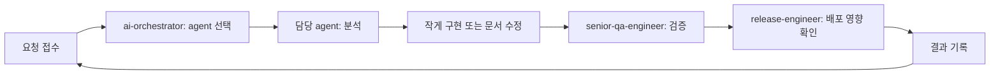

# Workflow: Project Operating Loop

## 목적

프로젝트를 운영할 때 반복적으로 사용할 기본 루프입니다.
기능, 디자인, 콘텐츠, QA, 릴리스 작업에 공통으로 적용합니다.

## 기본 순서

## 단계별 기준

1. 요청 접수
   - 사용자의 실제 목표를 확인합니다.
   - 이미 있는 파일과 사용자 변경을 확인합니다.
2. agent 선택
   - `ai/agents/README.md` 기준으로 역할을 고릅니다.
   - 여러 agent가 필요하면 순서를 정합니다.
3. 분석
   - `ai/project-profile.md`와 관련 policy를 읽습니다.
   - 원본 파일을 확인합니다.
4. 구현
   - 가장 작은 변경으로 처리합니다.
   - 관련 문서와 하네스 설정을 함께 갱신합니다.
5. 검증
   - `npm run ai:loop`, `npm run lint`, `npm run build` 중 필요한 것을 실행합니다.
6. 기록
   - 변경 파일, 검증 결과, 남은 리스크를 남깁니다.

## 완료 기준

- 변경 목적이 사용자 요청과 일치합니다.
- 관련 agent 기준을 충족합니다.
- 필요한 검증을 통과했습니다.
- 남은 리스크가 명확히 정리되었습니다.
