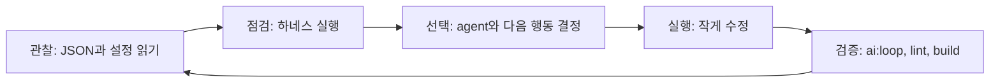

# AI Engineering Notes

이 문서는 이 포트폴리오 프로젝트에 하네스 엔지니어링과 루프 엔지니어링을 적용하기 위한 안내입니다.

## 목표

포트폴리오를 한 번에 크게 바꾸지 않습니다.
작게 분석하고, 작게 수정하고, 다시 검증하는 구조를 만듭니다.

## 현재 프로젝트 요약

- Next.js 기반 정적 포트폴리오입니다.
- 데이터 원본은 `public/resources/*.json`입니다.
- 주요 화면은 `Aside`, `ExperienceTimeline`, `Activities`, `Projects`, `SummarizeTimeline`입니다.
- GitHub Pages 배포를 위해 `basePath=/portfolio` 설정을 사용합니다.
- AI 설정은 `ai/` 폴더에 둡니다.

자세한 분석은 `ai/project-profile.md`를 기준으로 봅니다.

## 설정 위치

```text
AGENTS.md
ai/
  README.md
  project-profile.md
  policies/
  agents/
  prompts/
  workflows/
  templates/
```

## 어디에 무엇을 써야 하나요?

| 넣을 내용 | 위치 |
| --- | --- |
| 프로젝트 전체 규칙 | `AGENTS.md` |
| 현재 프로젝트 분석 | `ai/project-profile.md` |
| 모든 agent 공통 지침 | `ai/policies/global.md` |
| 개발 규칙 | `ai/policies/engineering.md` |
| 디자인 규칙 | `ai/policies/design.md` |
| QA 규칙 | `ai/policies/quality.md` |
| 콘텐츠 작성 규칙 | `ai/policies/content.md` |
| 배포 규칙 | `ai/policies/release.md` |
| agent 역할 | `ai/agents/*.md` |
| agent 선택 기준 | `ai/agents/README.md` |
| 반복 작업 순서 | `ai/workflows/*.md` |
| 작업 프롬프트 | `ai/prompts/*.md` |
| 새 agent 양식 | `ai/templates/agent-definition.md` |

## 하네스 엔지니어링

하네스는 AI 작업을 안정적으로 실행하기 위한 작업대입니다.
이 프로젝트에서는 `scripts/portfolio-ai-harness.mjs`가 하네스입니다.

하네스가 하는 일은 다음과 같습니다.

1. `public/resources/careers.json`을 읽습니다.
2. `public/resources/projects.json`을 읽습니다.
3. `public/resources/activities.json`을 읽습니다.
4. 포트폴리오 품질 규칙을 적용합니다.
5. `ai/` 설정 파일을 읽습니다.
6. `ai-runs/<실행시각>/report.json`을 만듭니다.
7. `context.md`, `prompt.md`, `loop.md`를 만듭니다.
8. `manifest.md`로 인식한 설정 파일 목록을 남깁니다.

현재 하네스는 외부 AI API를 직접 호출하지 않습니다.
대신 AI 도구에 줄 입력 파일을 자동으로 만듭니다.

## 루프 엔지니어링

루프는 한 번 실행하고 끝내지 않는 구조입니다.
결과를 보고 수정하고 다시 실행합니다.



## agent 운영 구조

현재 agent는 두 종류로 나뉩니다.

1. 공통 운영 agent
   - `ai-orchestrator`
   - `senior-product-manager`
   - `senior-frontend-engineer`
   - `senior-designer`
   - `senior-qa-engineer`
   - `release-engineer`
   - `ai-harness-engineer`
2. 포트폴리오 특화 agent
   - `portfolio-content-strategist`
   - `portfolio-reviewer`
   - `portfolio-content-editor`
   - `portfolio-quality-judge`

agent 목록과 선택 기준은 `ai/agents/README.md`를 봅니다.

## AI 도구에 처음 입력하는 방법

AI 도구가 이 프로젝트를 모른다면 아래처럼 시작합니다.

```text
AGENTS.md, ai/README.md, ai/project-profile.md를 먼저 읽어 주세요.
작업 성격에 맞는 workflow와 agent 파일을 선택해 주세요.
확인되지 않은 사실은 만들지 말고, 변경 후 필요한 검증을 실행해 주세요.
```

포트폴리오 콘텐츠를 고칠 때는 아래 파일도 함께 줍니다.

```text
최신 ai-runs/<실행시각>/context.md
최신 ai-runs/<실행시각>/report.json
최신 ai-runs/<실행시각>/manifest.md
```

## 실행 방법

하네스만 실행합니다.

```bash
npm run ai:harness
```

루프 산출물까지 만듭니다.

```bash
npm run ai:loop
```

코드 변경 후에는 아래를 실행합니다.

```bash
npm run lint
npm run build
```

## 다음 확장 후보

1. OpenAI API를 붙여 agent별 모델 호출을 자동화합니다.
2. `reviewer -> editor -> judge` 순서의 자동 루프를 만듭니다.
3. GitHub Actions에 `npm run ai:loop`를 추가합니다.
4. Playwright로 모바일/데스크톱 화면 검증을 추가합니다.
